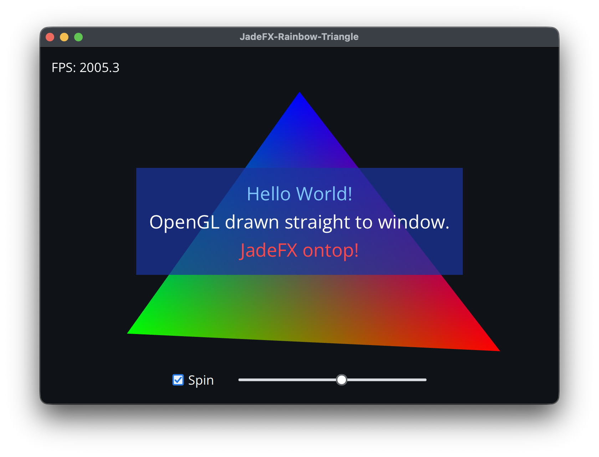

# AnarchyEngine-CPP

C++ game engine and IDE. JadeFX owns the window. The Scene View pane draws a spinning rainbow triangle.



## Build

This directory is enough. `make` clones the latest commit of [JadeFX](https://github.com/orange451/JadeFX_CPP) on `master`, and a later build updates that clone. It downloads GLFW 3.5.1 when GLFW is not already installed. The same build fetches [Luau](https://github.com/luau-lang/luau) 0.739. The engine package embeds that as the sandboxed Lua runtime.

`make test` builds and runs the Lua sandbox checks.

```sh
make
make run
```

`make run` rebuilds, then launches the app. On macOS the result is `build/AnarchyEngine-CPP.app`. On Windows and Linux it is a normal executable named `AnarchyEngine-CPP`.

The same build from CMake directly:

```sh
cmake -S . -B build -DCMAKE_BUILD_TYPE=Release
cmake --build build --parallel
```

A checkout named `JadeFX_CPP` next to this directory is used instead of the clone. Point `JADEFX_CPP_DIR` at the source to use some other checkout. A Linux build of the fetched GLFW also needs the X11 and Wayland development packages.

Shaders are loaded at startup from the app bundle (`Contents/Resources/shaders` on macOS) or from a `shaders/` directory beside the executable. Editing `shaders/triangle.vert` or `shaders/triangle.frag` takes effect on the next launch. The build also copies JadeFX's interface shaders into that same directory.
