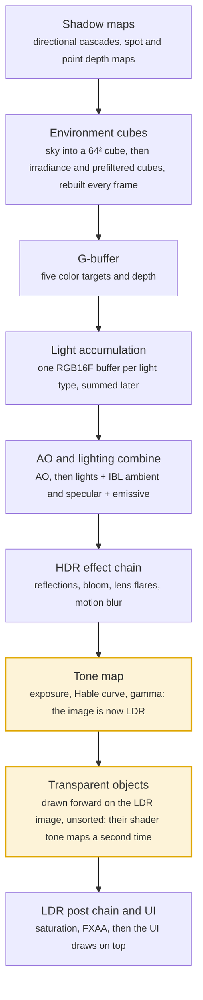
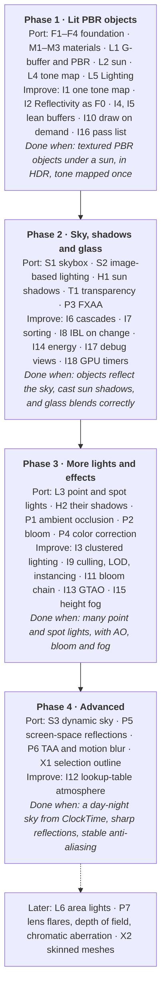

# Porting the Legacy Renderer

2026-09-30 · Survey of [orange451/AnarchyEngine](https://github.com/orange451/AnarchyEngine) (`master`) against AnarchyEngine-CPP at commit `722ef38`

## Summary

We should port the legacy engine's deferred PBR renderer in four phases, and fix its design flaws as we go rather than copy them. Phase 1 is a rendering foundation plus textured, sun-lit PBR objects with tone mapping. Everything else builds on it.

The report answers two questions:

- **What can we port, and in what order?** The legacy renderer and ours are inventoried in the next two sections. The feature menu lists every portable feature with an ID, a size and its dependencies.
- **How can we do better than the legacy renderer?** The improvements section lists fixes to its mistakes, cheaper frames, better image quality, and editor tooling, each tagged to the feature it changes.

The legacy renderer is a large step up from ours. Ours is a single pass that draws the diffuse texture and Material color under one fixed light. But the legacy renderer also has real flaws: it tone maps twice, its shadow cascades waste resolution, transparent objects are unsorted and barely lit, and it rebuilds its environment lighting every frame.

The decisions needed before the spec are listed near the end. The main one is which feature IDs go into the first spec.

## The legacy renderer

The legacy engine (Java, LWJGL) renders deferred PBR. Lights accumulate in screen space, the sky provides image-based lighting, and a long chain of screen effects finishes the image. Transparent objects are drawn afterwards in a separate forward pass. `GLRenderer.render()` runs the frame in a fixed order:

Amber marks the order that improvement I1 fixes, by tone mapping once after transparent objects.

### G-buffer

Opaque geometry writes five color targets plus a depth texture (`DeferredPipeline.java`, `InstanceDeferred.vs/.fs`). The vertex layout is position, normal, tangent, UV and color, the same as AMESH's first five locations.

| Target | Format | Contents |
| --- | --- | --- |
| 0 | RGB16F | Albedo: texture × Material color |
| 1 | RGBA16F | Motion vector (xy), geometric normal xy (zw) |
| 2 | RGBA16F | Normal-mapped world normal (xyz), geometric normal z (w) |
| 3 | RG8 | Roughness, metalness |
| 4 | RGBA16F | Emissive × albedo (rgb), mask ID (a): none, object, static sky, dynamic sky |
| Depth | DEPTH32F | Depth, with reverse-Z where `ARB_clip_control` exists |

### Materials

The legacy Material has Diffuse, Normal, Metallic and Roughness textures, plus Metalness (0), Roughness (0.4), Reflective (0.05), Color, Emissive and Transparency. Each scalar multiplies its texture, and a missing texture binds a white or flat default. **Reflective is uploaded but no shader reads it**; reflection strength comes only from metalness, roughness and Fresnel. Opacity is (1 − Material.Transparency) × (1 − GameObject.Transparency), and anything below 1 skips the G-buffer for the forward pass.

### Lights

Lighting is Cook-Torrance GGX with Schlick Fresnel, F0 = mix(0.04, albedo, metalness). Each light type adds into **its own full-screen RGB16F buffer**, and the buffers are summed later.

| Light | Drawn as | Properties |
| --- | --- | --- |
| Directional | Full-screen quad | Direction, ShadowDistance (50), ShadowMapSize (1024) |
| Point | Sphere scaled to Radius, front faces culled | Radius (8), ShadowMapSize (512) |
| Spot | Cone scaled by Radius and the outer angle | Direction, Radius, OuterFOV (80), InnerFOVScale (0.1), ShadowMapSize (1024) |
| Area | LTC lookup textures | Direction, SizeX, SizeY |

All lights also have Position, Intensity, Color, Shadows and Visible. Attenuation is max(1 − d/radius, 0)/d.

### Environment and sky

- **Combine pass** (`Lighting.fs`): sums the light buffers, then adds ambient from an irradiance cube and specular from a prefiltered cube with a BRDF lookup table, both scaled by AO, then emissive.
- **Every frame**, the sky is drawn into a 64² cube, convolved into a 32² irradiance cube, and prefiltered into a 128² cube over 5 mips (GGX, 128 samples). The 512² BRDF table is built once.
- **Three sky modes:** DynamicSkybox (single-scattering atmosphere ray-march, sun disc, fbm clouds, plus a sun light with a 4096 shadow map); Skybox (an equirect image turned into a cube); or neither (flat Lighting.Ambient).

### Shadows

- **Directional:** a 4-layer depth array with four cascades sized 0.1, 0.3, 0.5 and 1.0 × ShadowDistance × 2. They are **centered on the camera, not split along the view frustum**. One geometry-shader pass draws all four; lookup is 3×3 PCF.
- **Spot:** one 2D shadow map, 3×3 PCF.
- **Point:** a depth cube drawn by a geometry shader (6 invocations).
- Transparent objects cast no shadows.

### Screen effects

The deferred chain runs in this order, each pass into its own RGBA16F target (`MultiPass.java`):

1. Ambient occlusion: half resolution, 4 ray-marched hemisphere rays per pixel, noisy by design
2. Lighting combine
3. Screen-space reflections: half resolution, only where roughness < 0.75 (off by default)
4. Reflection merge
5. Bloom: color × 0.1 with no threshold, a 17-tap Gaussian at half resolution, added back
6. Lens flares (off by default)
7. Motion blur: 12 taps along the motion vector
8. Color correction: exposure, then the Hable curve, then gamma
9. TAA (off by default)

After the forward pass, a second chain runs on the tone-mapped image: saturation and dither, chromatic aberration (off), depth of field (off), then FXAA (on).

### Transparency

Transparent objects are drawn after the deferred image, with up to 8 directional lights and IBL; point lights are commented out. They are **not sorted**, and they get no AO, reflections or bloom. Because the image is already tone mapped, this shader tone maps itself.

### Never wired up

Volumetric light, particles, water, instancing, entity reflection probes and voxel GI exist as code or shaders but nothing calls them. There is also no frustum culling. The compute-shader paths (HBAO, SSDO) need GL 4.3.

## Our renderer today

Our Scene View draws each mesh once, straight into the window, with its diffuse texture and Material color under one fixed light. As of commit `722ef38` (Texture importing and texture rendering), that is the whole renderer: no offscreen targets, real lights, shadows, sky or tone mapping.

### How a frame gets drawn

1. The simulation thread writes instances, and `SnapshotPump` packs a `VisualSnapshot`: camera, one row per GameObject in Workspace (`VisualInstance`: transform, prefab, field of view), and each prefab's meshes (`VisualMesh`: mesh path, session geometry, diffuse texture path, color).
2. `runner::SceneFeed` triple-buffers snapshots to the JadeFX UI thread, which owns the GL context.
3. `GameView::renderContent` runs during the UI pass and calls `Renderer::draw`. It scissors to the pane, clears, and issues one draw per instance × mesh, always at LOD 0.
4. `mesh.frag` computes albedo as diffuse texture × Material.Color × vertex color, then Lambert lighting from a constant direction (0.4, 1, 0.6) with 0.25 ambient. Alpha is forced to 1.
5. The renderer restores GL state and the UI draws on top.

### What exists

| Area | State | Where |
| --- | --- | --- |
| Context | GL 3.3 core; 4.1 core on macOS; JadeFX also has a GLES 3 path | `JadeFX_CPP/src/platform/GlfwHost.cpp` |
| GL loader | Hand-written: buffers, shaders, draws, and now 2D textures, mipmaps, `Uniform1i/4f` | `src/runner/gl.hpp`, `gl.cpp` |
| Shaders | One program, GLSL 330, loaded from files; no includes, defines or hot reload | `resources/shaders/mesh.vert/.frag`, `src/runner/ShaderFile.cpp` |
| Meshes | AMESH: position, normal, UV, tangent + sign, color, 4 bones; LODs, subsets, bounding box; hot reload | `src/amesh/`, `src/runner/MeshCache.cpp` |
| Textures | stb_image decode, RGBA8 upload with mipmaps, reload when the file changes; studio import copies images into `resources/textures` | `src/runner/TextureCache.cpp`, `src/ide/TextureImport.cpp` |
| Material in the snapshot | DiffuseTexture path and Color only | `SnapshotPump.cpp` |
| Projection | Hand-written perspective, near 0.1, far 1000 | `Renderer.cpp` |

### What is missing

- **Framebuffers.** There is no offscreen or HDR target, no multiple render targets, blending, culling or depth-function control in the loader. Everything draws into the default framebuffer.
- **Most of the Material.** Normal, Roughness and Metalness textures, Reflectivity and Transparency never reach the GPU. There are no Metalness, Roughness or Emissive scalars.
- **Color space.** Textures upload as linear RGBA8 and the output has no gamma step. That looks right today only because both mistakes cancel; PBR lighting needs sRGB textures and a linear-to-sRGB output.
- **Rendering instances.** At `722ef38` there is no Light class (only icons for DirectionalLight and spot lights), no Skybox and no render settings. Lighting's Ambient, Brightness, ClockTime and Fog\* properties exist but the renderer ignores them.
- **Motion data.** The snapshot has no previous-frame transforms, which motion vectors, TAA and motion blur need.
- **Culling and LOD.** Every mesh draws, always at LOD 0.
- **Lifecycle.** `Renderer` has no destructor and rebuilds GL objects on a tab switch (code-quality review, §3.4).

The AMESH vertex layout already matches the legacy layout, so normal mapping and skinning need no vertex-format change.

## Constraints on the port

Four facts shape how each legacy feature is ported. None blocks a feature; each changes how one is built.

| Constraint | What it rules out | What we do instead |
| --- | --- | --- |
| GL 3.3 core on Windows and Linux, 4.1 on macOS | Compute shaders, SSBOs, `imageStore` (legacy HBAO, SSDO, voxel GI); geometry-shader instancing (GL 4.0) for cube faces and cascades | Fragment-shader versions of each effect; draw the 6 cube faces and 4 cascades as separate passes; texture buffers (core in 3.1) for light lists |
| Legacy world is Z-up; ours is Y-up | Copying sky, IBL and shadow shaders as they are | Swap axes in each ported shader: sky height, irradiance up vector, cube-face cameras |
| Reverse-Z needs `glClipControl` (GL 4.5), missing on macOS | Reverse-Z everywhere | Standard depth by default; reverse-Z only where the extension exists, as legacy did |
| Legacy `Reflective` was never used | Porting its meaning | Define Reflectivity ourselves (see Improvements: F0 = 0.16 × Reflectivity²) |

The GLES 3 path in JadeFX has the same ceiling as GL 3.3, so staying inside 3.3 keeps a mobile renderer possible. Our Reflectivity and Transparency accept any finite number, like Roblox's Transparency; the renderer reads them clamped to 0–1.

## Feature menu

Every legacy feature worth porting is listed below with an ID, a relative size and what it needs first. The Phase column holds the suggested phase; change it to pick what goes into the spec.

Sizes are relative: S is a contained change, M touches several systems, L is a project of its own.

| ID | Feature | Size | Needs | Notes | Phase |
| --- | --- | --- | --- | --- | --- |
| F1 | GL loader coverage plus framebuffer, texture and shader helper classes | M | none | Textures landed in `722ef38`; framebuffers, multiple render targets, blend, cull and depth state missing | Phase 1 |
| F2 | Offscreen HDR target per Scene View, drawn into its pane | M | F1 | Views differ in size, so each owns its targets | Phase 1 |
| F3 | Shader includes, defines and hot reload | S | none | Legacy had all three | Phase 1 |
| F4 | Matrix4 math: inverse, ortho, lookAt | S | none | Needed for shadows and position-from-depth | Phase 1 |
| M1 | Whole Material in the snapshot, with a dirty bit | S | none | DiffuseTexture and Color already flow | Phase 1 |
| M2 | sRGB upload for color textures, linear for data textures | S | none | Loading and import already work | Phase 1 |
| M3 | Metalness, Roughness and Emissive on Material | S | none | Metalness and Roughness use the new slider | Phase 1 |
| L1 | Deferred G-buffer and PBR lighting | M | F1–F4, M1 | The heart of the port | Phase 1 |
| L2 | DirectionalLight instance and pass | M | L1 | | Phase 1 |
| L3 | PointLight and SpotLight instances | M | L1 | Sphere and cone volumes, or clustered (I3) | Phase 3 |
| L4 | Tone mapping, exposure, gamma; Exposure and Gamma on Lighting | S | F2 | | Phase 1 |
| L5 | Use Lighting's Ambient, Brightness and Fog | S | L1 | Properties already exist | Phase 1 |
| L6 | Area lights (LTC lookup textures) | L | L1 | | Later |
| S1 | Skybox instance: equirect image to cubemap | M | M2 | | Phase 2 |
| S2 | Image-based lighting: irradiance, prefiltered cube, BRDF table | M | S1 or S3 | | Phase 2 |
| S3 | Dynamic sky: atmosphere, sun from ClockTime, clouds | M | F2 | | Phase 4 |
| H1 | Directional shadows, 4 cascades | M | L2 | | Phase 2 |
| H2 | Spot and point shadows | M | L3 | | Phase 3 |
| P1 | Ambient occlusion | M | L1 | | Phase 3 |
| P2 | Bloom | S | F2 | | Phase 3 |
| P3 | FXAA | S | F2 | Legacy default | Phase 2 |
| P4 | Saturation, color correction, dither | S | F2 | | Phase 3 |
| P5 | Screen-space reflections | M | L1 | Where Reflectivity shows most | Phase 4 |
| P6 | TAA and motion blur | M | L1 | Needs previous-frame transforms in the snapshot | Phase 4 |
| P7 | Lens flares, depth of field, chromatic aberration | S each | P2 | Off by default in legacy | Later |
| T1 | Transparent objects: forward pass using Transparency | S–M | L1 | | Phase 2 |
| X1 | Selection outline and gizmos | S | F2 | | Phase 4 |
| X2 | Skinned meshes | M | animation system | AMESH already carries bones | Later |

Not listed, because legacy never wired them up: volumetric light, particles, water, reflection probes and voxel GI.

## Improvements over the legacy design

Eighteen changes make the port better than the original. Five of them (I1, I2, I4, I5, I16) cost almost nothing if built in from the start but are expensive to retrofit, so they belong in Phase 1.

| ID | Improvement | Kind | Changes | Cost |
| --- | --- | --- | --- | --- |
| I1 | Tone map once, at the very end, after transparent objects; one modern curve (ACES fitted, AgX or Khronos PBR Neutral); write through an sRGB framebuffer | Fix | L4, T1 | S |
| I2 | Reflectivity sets dielectric F0 = 0.16 × Reflectivity², Filament's "reflectance": the 0.5 default gives the standard 0.04 | Fix | M3, L1 | S |
| I3 | Clustered lighting: the CPU sorts lights into screen tiles and uploads the lists as a texture buffer, so one light list lights opaque and transparent objects | Speed | L3, T1 | M |
| I4 | One light accumulation buffer instead of one per light type | Speed | L1–L3 | S |
| I5 | Smaller G-buffer: albedo RGBA8 sRGB, octahedral normals in two channels, roughness/metalness/AO in one RGBA8, emissive straight into the light buffer, position rebuilt from depth. About 12 bytes a pixel instead of about 34 | Speed | L1 | S |
| I6 | Real cascaded shadows: split along the view frustum, snap to texels so edges don't shimmer, normal-offset bias | Fix | H1 | S |
| I7 | Sort transparent objects back to front; optionally weighted blended order-independent transparency, which needs per-target blending (GL 4.0, or a common extension on 3.3) | Fix | T1 | S |
| I8 | Rebuild environment lighting only when the sky changes; spread a dynamic sky over frames, one cube face at a time | Speed | S2, S3 | S |
| I9 | Frustum culling from AMESH bounding boxes, LOD selection, instancing for repeated prefabs | Speed | L1 | M |
| I10 | Render the editor on demand: redraw only when the snapshot or camera changes (after TAA settles) | Speed | F2 | S |
| I11 | Bloom from a downsample/upsample mip chain (Jimenez, 2014) instead of an unthresholded 17-tap blur | Quality | P2 | S |
| I12 | Sky from Hillaire's lookup-table atmosphere (2020) instead of a per-pixel ray-march | Quality | S3 | M |
| I13 | GTAO, or SSAO at half resolution with a depth-aware blur, instead of noisy ray-marched AO | Quality | P1 | M |
| I14 | Multiple-scattering energy compensation and specular occlusion: rough metals stop losing light | Quality | L1, S2 | S |
| I15 | Height fog from the existing `Lighting.Fog*` properties | Quality | L5 | S |
| I16 | A pass list: each pass declares what it reads and writes, and each Scene View owns targets at its own size | Tooling | F2 | M |
| I17 | Debug views in the Scene View: albedo, normals, roughness, AO, light volumes, cascades | Tooling | L1 | S |
| I18 | GPU time per pass from timer queries (core in GL 3.3), shown beside the FPS counter | Tooling | F1 | S |

### Why these matter most

- **I1** fixes the worst legacy bug. Tone mapping before transparency means transparent objects blend in the wrong space, and their shader has to tone map a second time.
- **I2** gives our Reflectivity a physical meaning at no cost, where legacy's Reflective did nothing.
- **I5** and **I4** set the frame's memory budget. Changing the G-buffer later means rewriting every pass that reads it.
- **I16** decides how every later feature plugs in. Without it, each feature edits one long hand-ordered draw function, as legacy's did.
- **I10** matters because the studio is idle most of the time but redraws every Scene View at 120 FPS today.

## Suggested phases

Four phases, each ending in something visible in the Scene View. Phase 1 is the largest because it sets the foundation and five design choices that are costly to change later.

Phase 1 alone replaces today's single unlit pass with the full deferred path. Each later phase adds to it without reworking it, as long as the pass list (I16) and the lean G-buffer (I5) are in place from the start.

## Decisions needed before the spec

The first decision is which rows go into the spec: set the Phase column in the feature menu. The rest each change how a Phase 1 or Phase 2 feature is built.

| Decision | Options | Recommendation |
| --- | --- | --- |
| What Reflectivity controls | Dielectric F0 (I2); a multiplier on reflections only; unused, as in legacy | F0 = 0.16 × Reflectivity² |
| How point and spot lights are drawn | Light volumes per light, as legacy; clustered lists (I3) | Clustered, since it also lights transparent objects |
| How transparency is drawn | Sorted forward pass; weighted blended OIT | Sorted first; OIT later if overlapping glass looks wrong |
| Tone-mapping curve | ACES fitted; AgX; Khronos PBR Neutral; legacy Hable | Khronos PBR Neutral: it keeps Material colors closest to what was picked |
| What drives the sun | Lighting.ClockTime (exists); a DynamicSkybox.Time like legacy | Lighting.ClockTime, so there is one clock |
| Lighting properties to add | Exposure, Gamma, Saturation (legacy); what Brightness means | Add Exposure and Saturation; drop Gamma behind an sRGB framebuffer; Brightness = sun intensity |
| GL ceiling | Stay at 3.3 (keeps GLES 3 and mobile possible); require 4.x on desktop | Stay at 3.3, use newer features only behind checks |
| Material range | Reflectivity and Transparency accept any number (current); clamp in the setter | Keep as is; the renderer clamps |

## Appendix: where to look

Legacy paths are in [orange451/AnarchyEngine](https://github.com/orange451/AnarchyEngine) on `master`, under `src/main/`. Our paths are relative to the AnarchyEngine-CPP root.

| Topic | Legacy | Ours |
| --- | --- | --- |
| Frame order | [GLRenderer.java](https://github.com/orange451/AnarchyEngine/blob/master/src/main/java/engine/gl/GLRenderer.java) | `src/runner/GameView.cpp`, `src/runner/Renderer.cpp` |
| G-buffer | [DeferredPipeline.java](https://github.com/orange451/AnarchyEngine/blob/master/src/main/java/engine/gl/DeferredPipeline.java), `shaders/renderers/InstanceDeferred.vs/.fs` | none yet |
| Lighting math | [lighting.isl](https://github.com/orange451/AnarchyEngine/blob/master/src/main/resources/assets/shaders/includes/lighting.isl), `java/engine/gl/lights/*Handler.java` | `resources/shaders/mesh.frag` |
| Combine and IBL | [Lighting.fs](https://github.com/orange451/AnarchyEngine/blob/master/src/main/resources/assets/shaders/deferred/Lighting.fs), [EnvironmentRenderer.java](https://github.com/orange451/AnarchyEngine/blob/master/src/main/java/engine/gl/EnvironmentRenderer.java) | none yet |
| Sky | [SkyRenderer.java](https://github.com/orange451/AnarchyEngine/blob/master/src/main/java/engine/gl/SkyRenderer.java), `shaders/sky/` | none yet |
| Shadows | [DirectionalLightShadowMap.java](https://github.com/orange451/AnarchyEngine/blob/master/src/main/java/engine/gl/lights/DirectionalLightShadowMap.java) | none yet |
| Screen-effect chain | [MultiPass.java](https://github.com/orange451/AnarchyEngine/blob/master/src/main/java/engine/gl/pipeline/MultiPass.java), [PostProcessPipeline.java](https://github.com/orange451/AnarchyEngine/blob/master/src/main/java/engine/gl/PostProcessPipeline.java) | none yet |
| Tone mapping | [ColorCorrection.fs](https://github.com/orange451/AnarchyEngine/blob/master/src/main/resources/assets/shaders/deferred/ColorCorrection.fs) | none yet |
| Transparency | [InstanceForwardRenderer.java](https://github.com/orange451/AnarchyEngine/blob/master/src/main/java/engine/gl/renderers/InstanceForwardRenderer.java) | none yet |
| Feature toggles | [RenderingSettings.java](https://github.com/orange451/AnarchyEngine/blob/master/src/main/java/engine/gl/RenderingSettings.java) | none yet |
| Material | [Material.java](https://github.com/orange451/AnarchyEngine/blob/master/src/main/java/engine/lua/type/object/insts/Material.java) | `src/engine_instances/AssetInstances.hpp` |
| Selection and gizmos | [HandlesRenderer.java](https://github.com/orange451/AnarchyEngine/blob/master/src/main/java/engine/gl/HandlesRenderer.java) | none yet |
| Snapshot and threads | n/a | `src/engine_core/SnapshotPump.hpp`, `src/runner/SceneFeed.hpp`, `src/engine_core/README.md` |
| GPU assets | n/a | `src/runner/MeshCache.cpp`, `src/runner/TextureCache.cpp`, `src/amesh/amesh_gl.cpp` |
| GL loader and context | `java/engine/util/GLCompat.java` | `src/runner/gl.hpp`, `JadeFX_CPP/src/platform/GlfwHost.cpp` |

### Sources

- [AnarchyEngine (legacy, Java)](https://github.com/orange451/AnarchyEngine), read at `master` on 2026-09-30.
- AnarchyEngine-CPP at commit `722ef38`.
- Technique references named in this report, from memory: Filament's reflectance parameter and energy compensation; Jimenez, "Next Generation Post Processing in Call of Duty: Advanced Warfare" (2014); Hillaire, "A Scalable and Production Ready Sky and Atmosphere Rendering Technique" (2020); McGuire and Bavoil, weighted blended order-independent transparency (2013).
